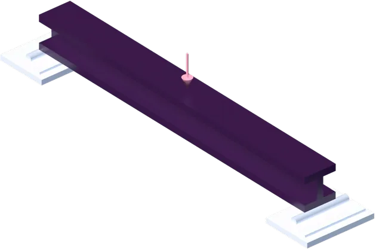
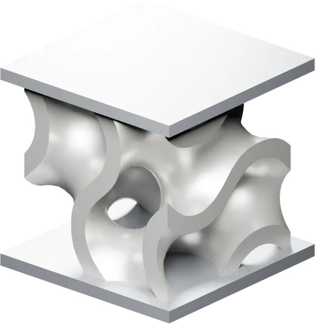

# pyvista-blender

> [!WARNING]
> **Very early development.** APIs, defaults, and module layout will
> change without notice until the first stable release. Bug reports,
> missing-feature requests, and PRs are all very welcome — please open
> an [issue](https://github.com/kmarchais/pyvista-blender/issues) if
> something doesn't work or behaves surprisingly.

Render [PyVista](https://docs.pyvista.org/) plotter scenes through
[Blender](https://www.blender.org/) (`bpy`) — photoreal output, full
animation export, no file round-trip.

Build the scene once in PyVista. Pick VTK's preview or Blender's
Cycles / Eevee Next for the final render. Export entire deforming,
colour-evolving, lit animations to a single `.blend` that plays
natively in Blender with **no Python script inside**.

## Showcase

These structural mechanics examples start as PyVista scenes and use
Blender for the final render. The transparent animated WebP previews
link to the transparent VP9 WebM files.

<table>
  <tr>
    <td width="50%">
      <a href="./docs/assets/examples/structural_mechanics/beam_bending.webm">
        
      </a>
    </td>
    <td width="50%">
      <a href="./docs/assets/examples/structural_mechanics/gyroid_compression.webm">
        
      </a>
    </td>
  </tr>
  <tr>
    <td><strong>I-beam bending</strong><br>Fedoo stress animation with support and load geometry.</td>
    <td><strong>Gyroid compression</strong><br>Metallic gyroid material revealed through a stress-alpha overlay.</td>
  </tr>
</table>

## Status

Pre-release (`0.1.0.dev0`). The offline render path, the desktop and
browser interactive viewports, the Jupyter inline backend, and the
full animation export to `.blend` are implemented and tested. The full
ruff (`select = ["ALL"]`) + ty + format gate is clean.
See the [features list in the docs](./docs/index.md#features) for the
full surface and the [architecture page](./docs/architecture.md) for
the translation pipeline.

## Install

```bash
pip install pyvista-blender
# or
uv add pyvista-blender
```

For the Jupyter inline backend and the Trame-served browser viewport
(`pl.blender.show(backend="web")`), install `pyvista[jupyter]`
alongside; the bridge reuses pyvista's Trame stack rather than
shipping its own extras.

```bash
pip install pyvista-blender 'pyvista[jupyter]'
```

Requires Python **3.11** (Blender 4.5 LTS via `bpy>=4.5,<5`) **or
3.13** (Blender 5.x via `bpy>=5.0,<6`). Python 3.10, 3.12, and 3.14
have no matching `bpy` wheel on PyPI; `requires-python` blocks them.

## Quick start

```python
import pyvista as pv

pl = pv.Plotter(off_screen=True, window_size=(1920, 1080))
pl.add_mesh(pv.read("data.vtu"), scalars="von_mises", cmap="viridis", pbr=True)
pl.add_light(pv.Light(position=(5, -5, 5), light_type="scene light"))
pl.camera_position = "iso"

# Offline render via Cycles + OptiX denoise. No `import pyvista_blender`
# needed — the namespace registers itself on install through PyVista
# 0.48's plotter-component entry point.
pl.blender.render("frame.png", samples=128)

# Interactive hybrid viewport: VTK 60 fps during drag, Cycles render
# on mouse release. One window, mouse-driven, no auto-exec prompts.
pl.blender.show()
```

## API surface

| Entry point                                                             | What it does                                                                           |
| ----------------------------------------------------------------------- | -------------------------------------------------------------------------------------- |
| `pl.blender.render(path, ...)`                                          | Render a single frame to PNG via Cycles or Eevee Next.                                 |
| `pl.blender.animate(path, updater, frames, fps=...)`                    | Render an animation as gif / mp4 / webm / mov / mkv via `imageio` + `imageio-ffmpeg`.  |
| `pl.blender.show()`                                                     | Hybrid VTK / Cycles interactive viewport — VTK during drag, settled Cycles on release. |
| `pl.blender.add_glyph(source, geom, *, orient, scale, factor)`          | Geometry-Nodes-instanced glyphs; memory cost scales `N + V` instead of `N · V`.        |
| `pl.blender.export_blend(path)`                                         | Save the live PyVista scene as a `.blend` for finishing in Blender.                    |
| `pl.blender.export_animation_blend(path, updater, frames, fps, **bake)` | Bake a full animation into a `.blend` that plays natively on file open.                |
| `pl.blender.orbit_camera(n_frames=...)`                                 | Build an `updater` for `animate` / `export_animation_blend`.                           |

Three-tier config resolution everywhere: per-call kwarg → component
attribute (`pl.blender.engine = ...`) → module default
(`pyvista_blender.config.*`).

## Animation export to `.blend`

`export_animation_blend` bakes each animation channel through its own
opt-in kwarg. Every backend plays back natively when the file is
opened in Blender — **no Python in the `.blend`, no auto-execution
prompt**, no need to "Run Scripts" on load.

| Kwarg                               | Mechanism                                                                                                                 | File layout               |
| ----------------------------------- | ------------------------------------------------------------------------------------------------------------------------- | ------------------------- |
| `bake_camera=True` (default)        | Keyframes on `scene.camera.location` + `rotation_quaternion` per frame                                                    | inside `.blend`           |
| `bake_deformation="shape_keys"`     | One Shape Key per frame, value-keyframed with linear interpolation                                                        | inside `.blend`           |
| `bake_deformation="mdd"` (= `True`) | Lightwave MDD sidecar + `MESH_CACHE` modifier                                                                             | `.blend` + `__<mesh>.mdd` |
| `bake_scalars=True`                 | Packed PNG (rows = frames, columns = vertices / cells) + Geometry Nodes graph; works for point-data and cell-data scalars | inside `.blend`           |
| `bake_lights=True`                  | Per-light keyframes on location, rotation, `energy`, `color`                                                              | inside `.blend`           |

Example: full multi-channel animation in one self-contained file.

```python
import numpy as np
import pyvista as pv

pl = pv.Plotter(off_screen=True, window_size=(1280, 720))
plane = pv.Plane(i_resolution=60, j_resolution=60)
plane.cell_data["heat"] = np.zeros(plane.n_cells, dtype=np.float32)
pl.add_mesh(plane, scalars="heat", cmap="inferno", clim=[-1.0, 1.0])

light = pv.Light(position=(5, 0, 4), light_type="scene light", intensity=1.0)
pl.add_light(light)

n_frames = 60
orbit = pl.blender.orbit_camera(n_frames=n_frames)
centers_xy = plane.cell_centers().points[:, :2]


def update(frame: int) -> None:
    orbit(frame)
    angle = -frame * (2.0 * np.pi / n_frames)
    light.position = (5.0 * np.cos(angle), 5.0 * np.sin(angle), 5.0)
    light.intensity = 0.4 + 0.6 * (0.5 + 0.5 * np.sin(frame * 0.3))
    r = np.linalg.norm(centers_xy, axis=1)
    plane.cell_data["heat"] = np.sin(2.0 * r - frame * 0.2).astype(np.float32)


pl.blender.export_animation_blend(
    "scene.blend",
    update,
    frames=range(n_frames),
    fps=30,
    bake_camera=True,
    bake_lights=True,
    bake_scalars=True,
)
pl.close()
```

Open `scene.blend` in Blender 4.5+ / 5.x and press <kbd>Space</kbd>:
camera orbits, the explicit light orbits in the opposite direction
while pulsing, the heat field travels as a radial wave with flat per-
cell shading. One file, ~500 KB, nothing to ship alongside.

## Development

```bash
uv sync --group dev --no-install-package bpy  # fast local sync (no 200 MB bpy wheel)
uvx prek install                              # install pre-commit hooks
uv run pytest                                 # ~10 s with bpy installed
uv run ruff check src/ tests/
uv run ruff format --check src/ tests/
uv run ty check
```

Real `bpy` is only needed for the `@pytest.mark.bpy` tests. CI runs
the full suite against the live wheel.

## License

GPL-3.0-or-later. Forced by `bpy`'s license; every source file
carries an SPDX header. See [`LICENSE`](./LICENSE).
