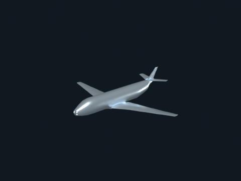
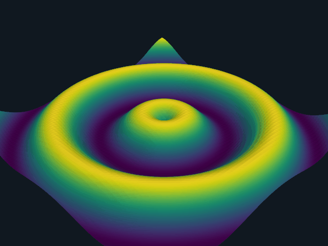

# Animation

Per-frame mesh updates and camera orbits through `pl.blender.animate(...)`.

## `orbit_animation.py`

A 360 degree turntable orbit of a static scene. Built on
`pl.blender.orbit_camera`.

[`examples/animation/orbit_animation.py`](https://github.com/kmarchais/pyvista-blender/blob/main/examples/animation/orbit_animation.py)
, recipe: [Animation](../cookbook/animation.md).

## `wave_animation.py`

Sine-wave deformation on a structured grid: animated geometry via
`pl.blender.animate(...)`, with the identity cache refreshing mesh
data in place. Topology stays constant across frames so the bpy mesh
is updated rather than rebuilt.

| PyVista (GL gif)                                               | Blender (Cycles mp4)                                                                                         |
| -------------------------------------------------------------- | ------------------------------------------------------------------------------------------------------------ |
|  | <video src="../assets/examples/animation/wave_blender.mp4" controls loop autoplay muted width="320"></video> |

[`examples/animation/wave_animation.py`](https://github.com/kmarchais/pyvista-blender/blob/main/examples/animation/wave_animation.py).
