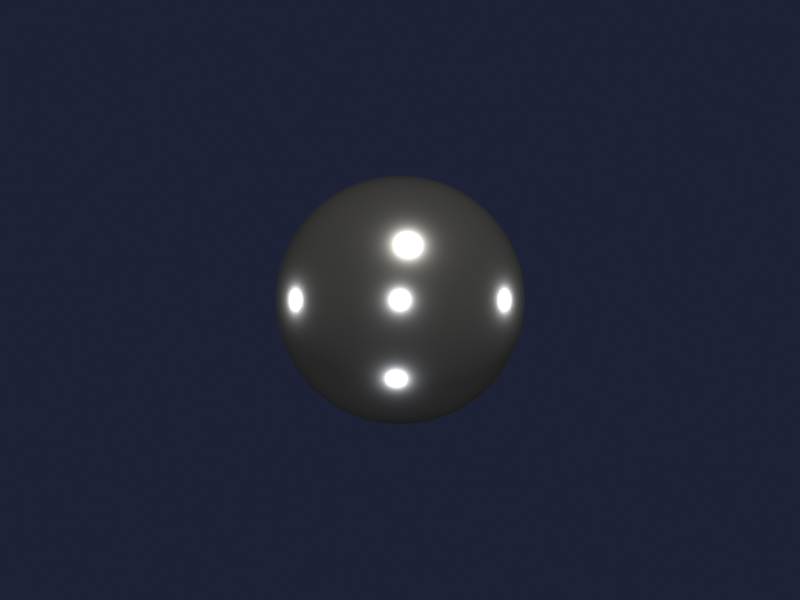
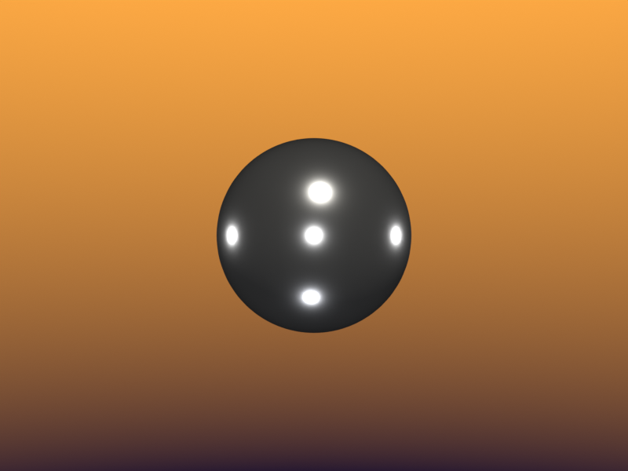
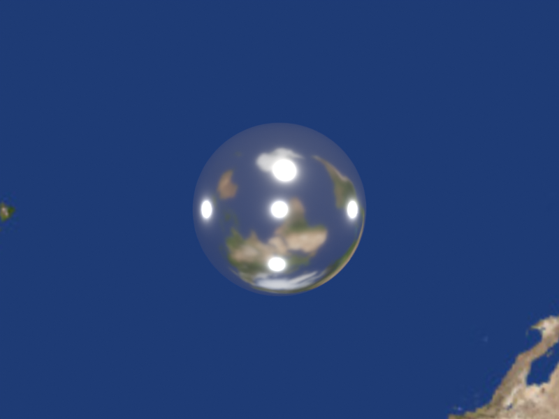
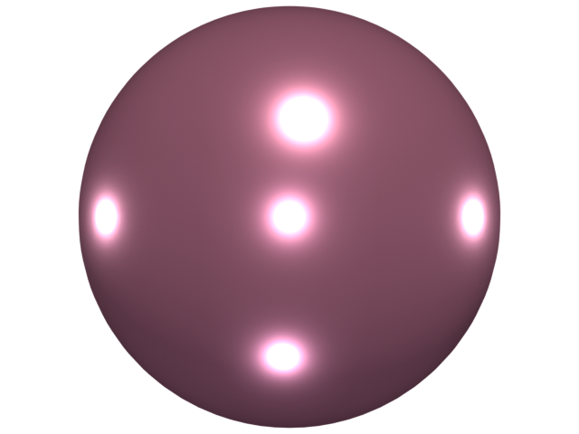
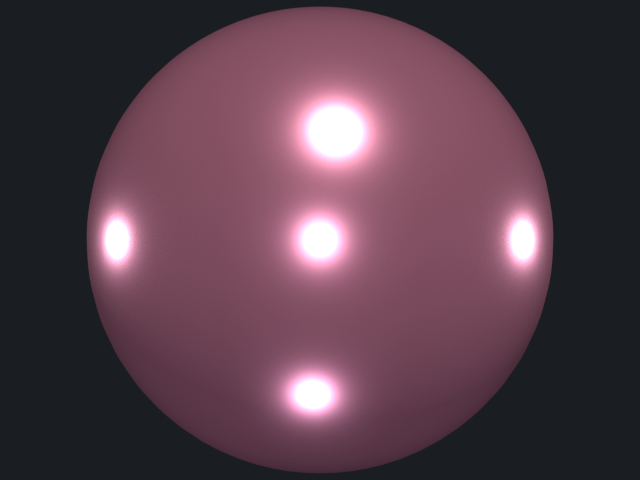

# Backgrounds

World shaders: solid color, vertical gradient, and HDRI environment.
The bridge's identity cache reuses mesh + material across all three
renders, so the only thing that changes is the World node tree.

## `environment.py`

The same metallic sphere under three world configurations.

| Solid                                                                  | Gradient                                                                     | HDRI                                                                 |
| ---------------------------------------------------------------------- | ---------------------------------------------------------------------------- | -------------------------------------------------------------------- |
|  |  |  |

[`examples/backgrounds/environment.py`](https://github.com/kmarchais/pyvista-blender/blob/main/examples/backgrounds/environment.py)
, recipe: [Backgrounds](../cookbook/backgrounds.md).

## `transparent_render.py`

Alpha-preserving render plus a denoise-toggle side-by-side. The "raw"
render keeps Cycles' noise visible so you can compare to the denoised
output at matching sample counts.

| Alpha (denoised)                                                                   | Raw (no denoise)                                                               |
| ---------------------------------------------------------------------------------- | ------------------------------------------------------------------------------ |
|  |  |

[`examples/backgrounds/transparent_render.py`](https://github.com/kmarchais/pyvista-blender/blob/main/examples/backgrounds/transparent_render.py).
