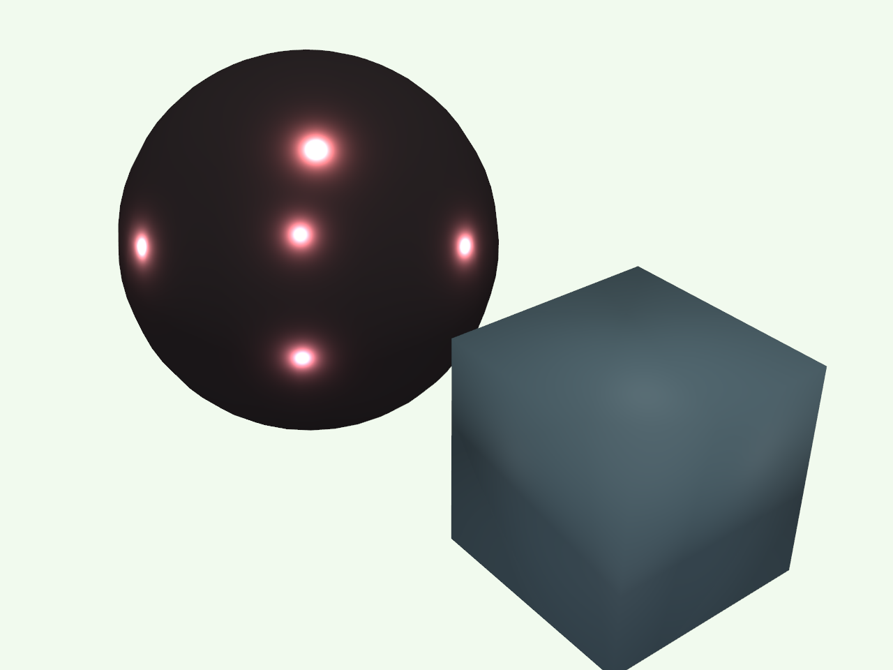
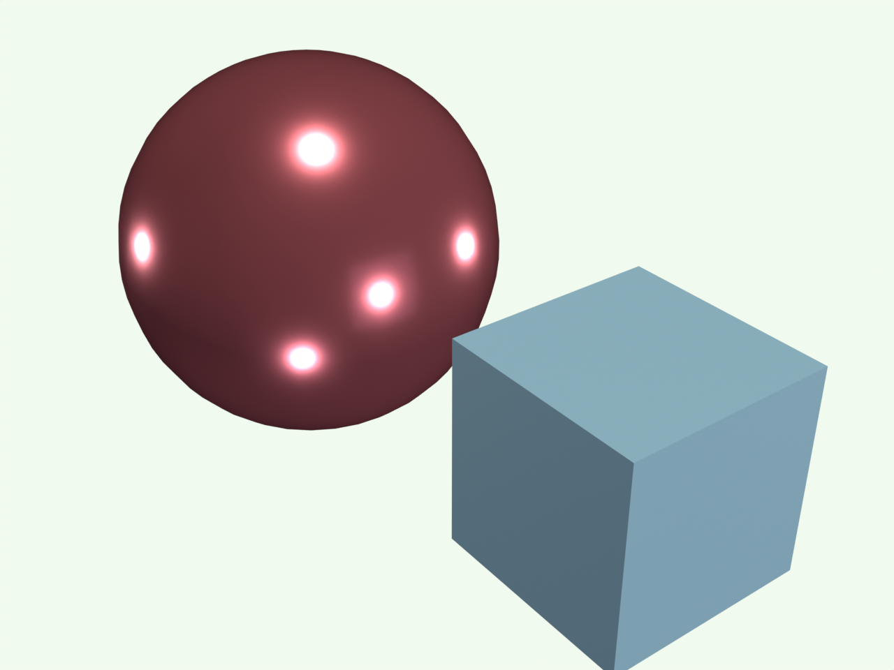
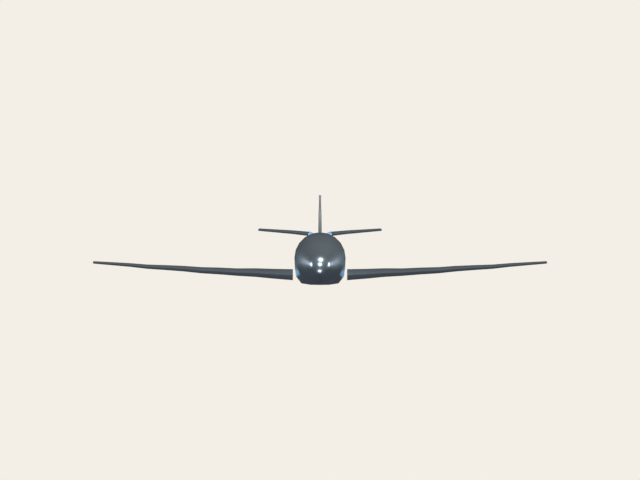
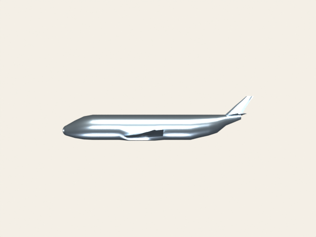
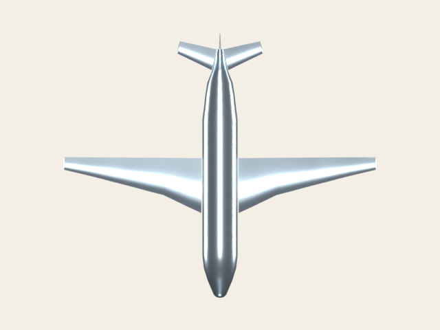

# Cameras & layout

Multi-actor scenes and multi-camera renders that exercise the bridge's
identity cache.

## `multi_actor.py`

Two actors in the same scene to verify the identity cache + per-actor
material translation. Each actor keeps its own material; the meshes
are de-duplicated by identity.

| PyVista                                                                    | Blender (Cycles)                                                           |
| -------------------------------------------------------------------------- | -------------------------------------------------------------------------- |
|  |  |

[`examples/cameras/multi_actor.py`](https://github.com/kmarchais/pyvista-blender/blob/main/examples/cameras/multi_actor.py).

## `ortho_multi_view.py`

Three orthographic views of the airplane mesh from one plotter,
exercises both the ortho-camera path and the L1 identity cache.

| Front                                                              | Side                                                             | Top                                                            |
| ------------------------------------------------------------------ | ---------------------------------------------------------------- | -------------------------------------------------------------- |
|  |  |  |

[`examples/cameras/ortho_multi_view.py`](https://github.com/kmarchais/pyvista-blender/blob/main/examples/cameras/ortho_multi_view.py).
