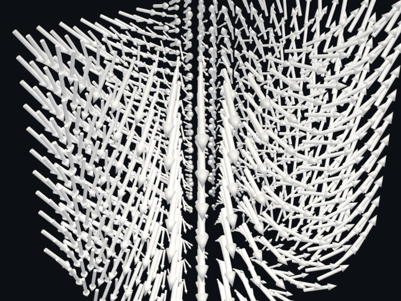

# Glyph instancing

Arrow glyphs instanced via Geometry Nodes
(`GeometryNodeInstanceOnPoints`). Memory scales `N + V` instead of
`N * V`, so a million-point vector field stays in budget.

## `glyph_vectors.py`

[`examples/glyphs/glyph_vectors.py`](https://github.com/kmarchais/pyvista-blender/blob/main/examples/glyphs/glyph_vectors.py)
, recipe: [Glyph instancing](../cookbook/glyphs.md).
