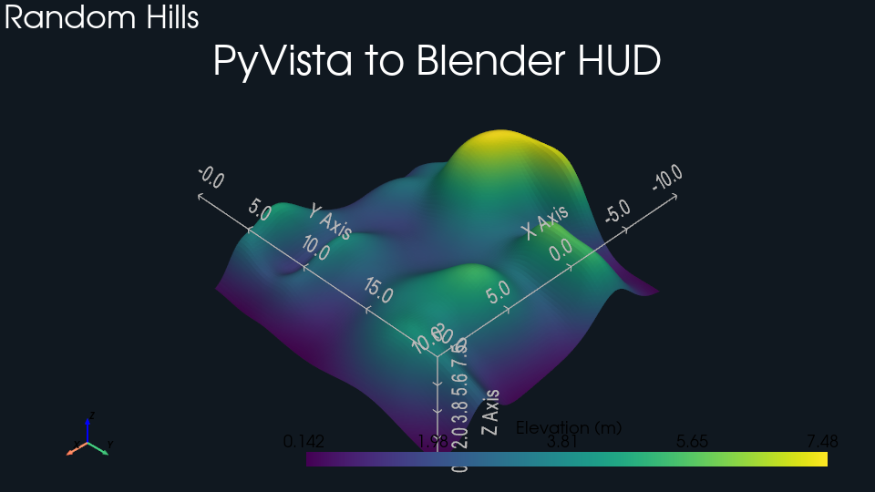
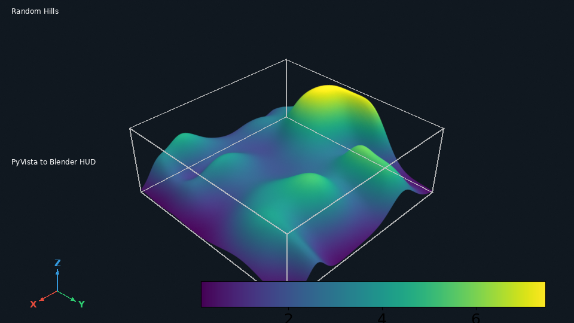

# HUD overlays

Every HUD overlay (scalar bar, text, axes triad, bounds box) composited
on one render through the Cycles compositor.

## `hud_demo.py`

| PyVista                                                          | Blender (Cycles)                                                 |
| ---------------------------------------------------------------- | ---------------------------------------------------------------- |
|  |  |

[`examples/hud/hud_demo.py`](https://github.com/kmarchais/pyvista-blender/blob/main/examples/hud/hud_demo.py)
, recipe: [HUD overlays](../cookbook/hud.md).
