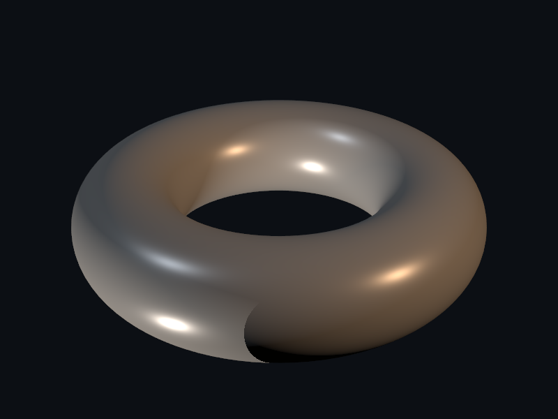
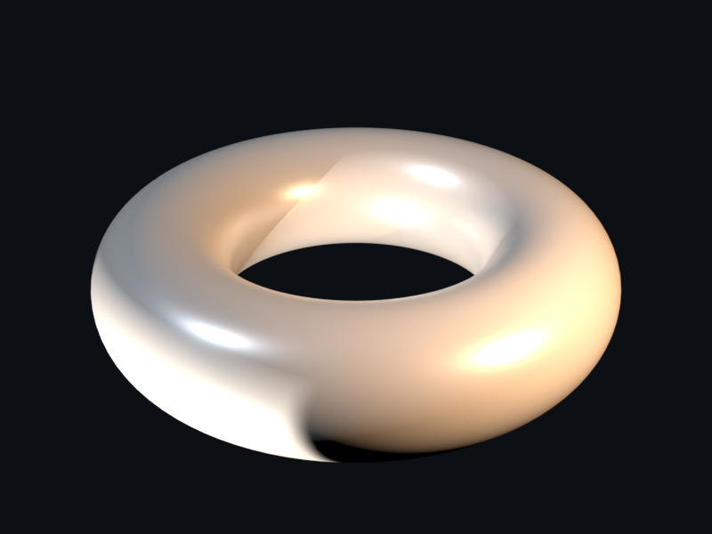

# Lights

Replace the default light kit with a custom rig that exercises every
branch of `translate/light.py`.

## `custom_lights.py`

A custom SUN + POINT + SPOT setup. Energy scaling, color, and
positioning are all set explicitly rather than inherited from the
default plotter kit.

| PyVista                                                                       | Blender (Cycles)                                                              |
| ----------------------------------------------------------------------------- | ----------------------------------------------------------------------------- |
|  |  |

[`examples/lights/custom_lights.py`](https://github.com/kmarchais/pyvista-blender/blob/main/examples/lights/custom_lights.py)
, recipe: [Lights](../cookbook/lights.md).
