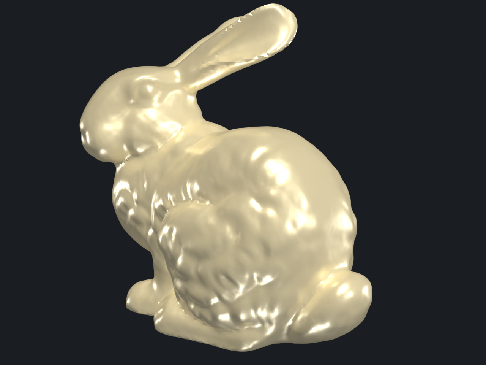
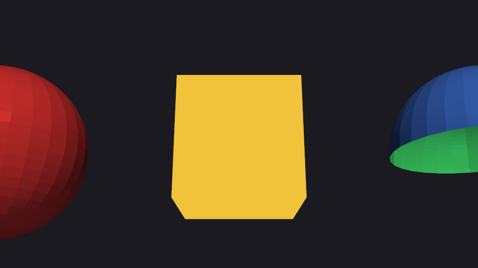
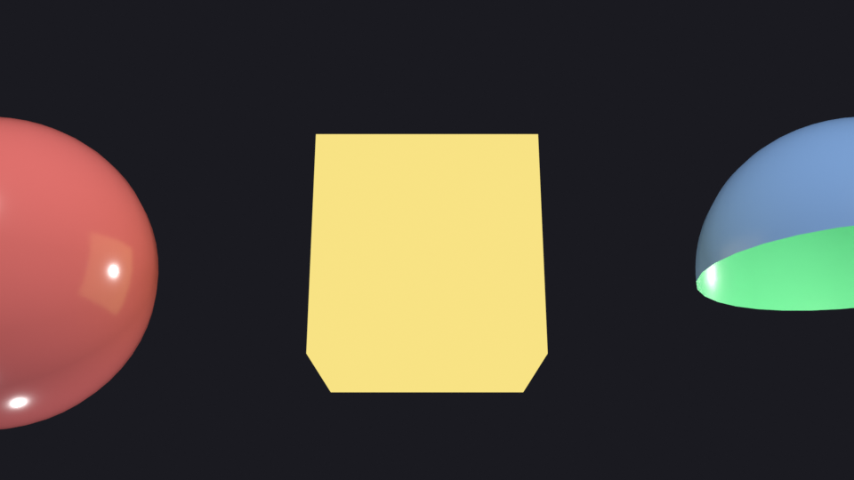

# PBR materials

Physically-based shading branches of the bridge: metallic roughness on
real meshes, and the four shading modes side by side.

## `bunny_pbr.py`

The Stanford Bunny with a metallic PBR material. Walter et al.
roughness fit on a real mesh, no scalars.

| PyVista                                                    | Blender (Cycles)                                           |
| ---------------------------------------------------------- | ---------------------------------------------------------- |
|  |  |

[`examples/pbr/bunny_pbr.py`](https://github.com/kmarchais/pyvista-blender/blob/main/examples/pbr/bunny_pbr.py)
, recipe: [PBR materials](../cookbook/pbr.md).

## `material_modes.py`

Side-by-side comparison of the shading branches: Phong, PBR metallic,
PBR rough, unlit. Same actor four times, different `interpolation`

- `metallic` + `lighting` combinations.

| PyVista                                                                      | Blender (Cycles)                                                             |
| ---------------------------------------------------------------------------- | ---------------------------------------------------------------------------- |
|  |  |

[`examples/pbr/material_modes.py`](https://github.com/kmarchais/pyvista-blender/blob/main/examples/pbr/material_modes.py).
