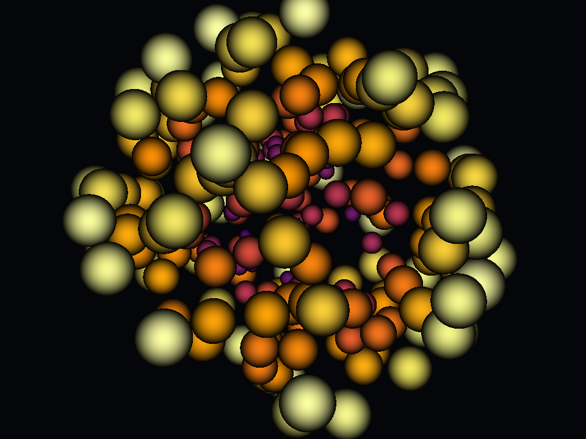
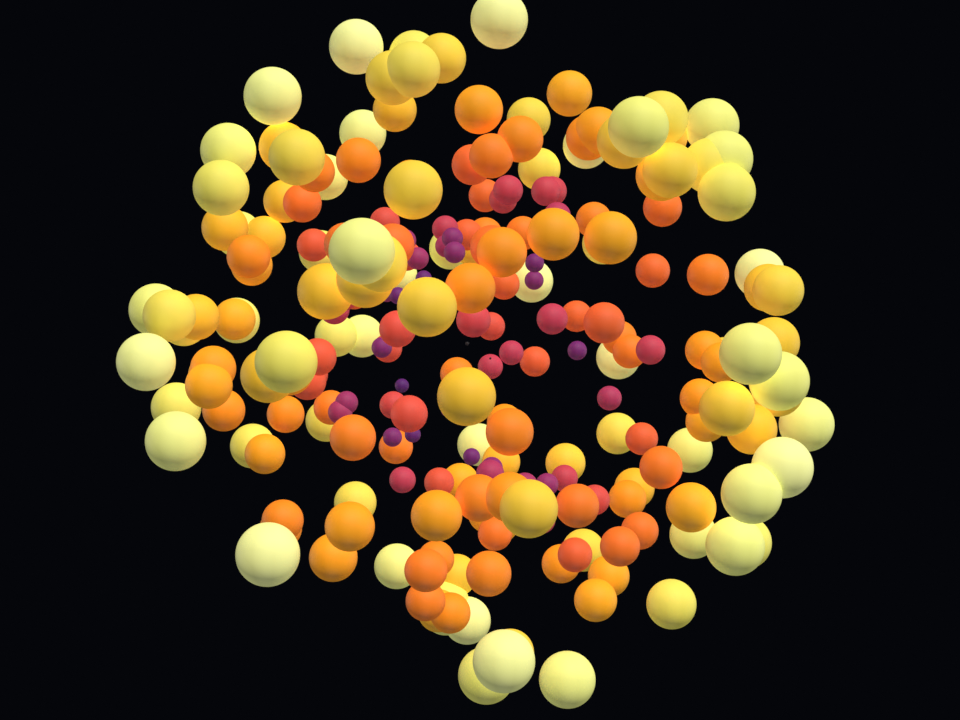

# Point clouds

Gaussian splats sized and coloured by a scalar field. Side-by-side
PyVista vs Blender compares GL sprite blending against Cycles per-point
spheres.

## `points_gaussian_sphere.py`

`scale_array = "radius"` drives per-point size from a radial scalar.

| PyVista                                                                                        | Blender (Cycles)                                                                               |
| ---------------------------------------------------------------------------------------------- | ---------------------------------------------------------------------------------------------- |
|  |  |

[`examples/point_clouds/points_gaussian_sphere.py`](https://github.com/kmarchais/pyvista-blender/blob/main/examples/point_clouds/points_gaussian_sphere.py)
, recipe: [Point clouds](../cookbook/point_clouds.md).
