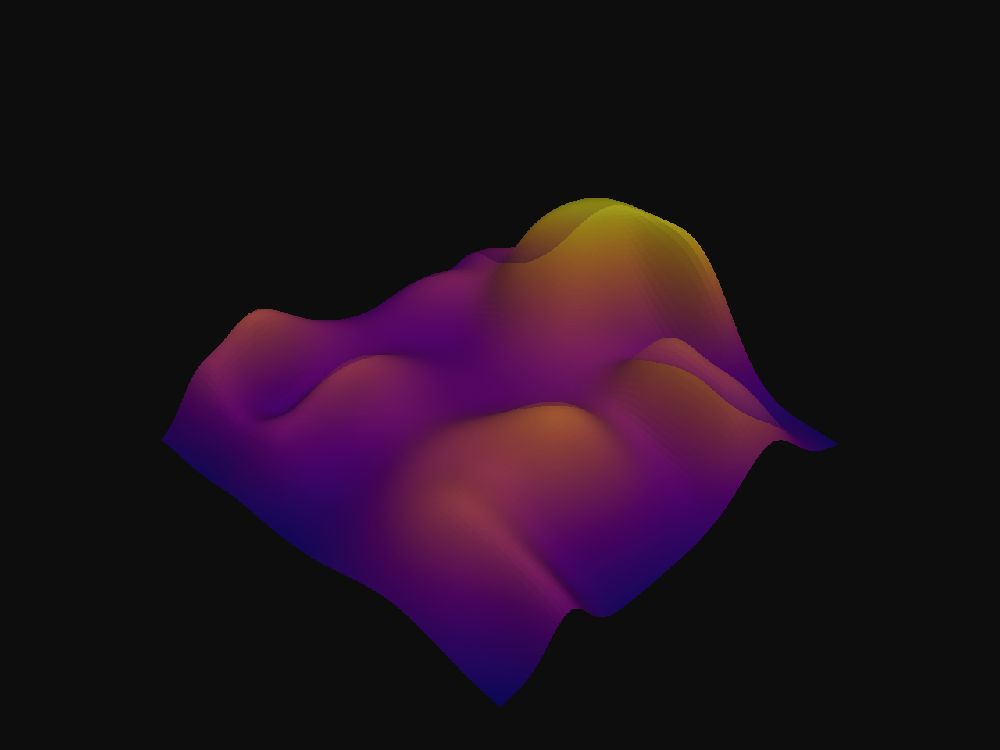
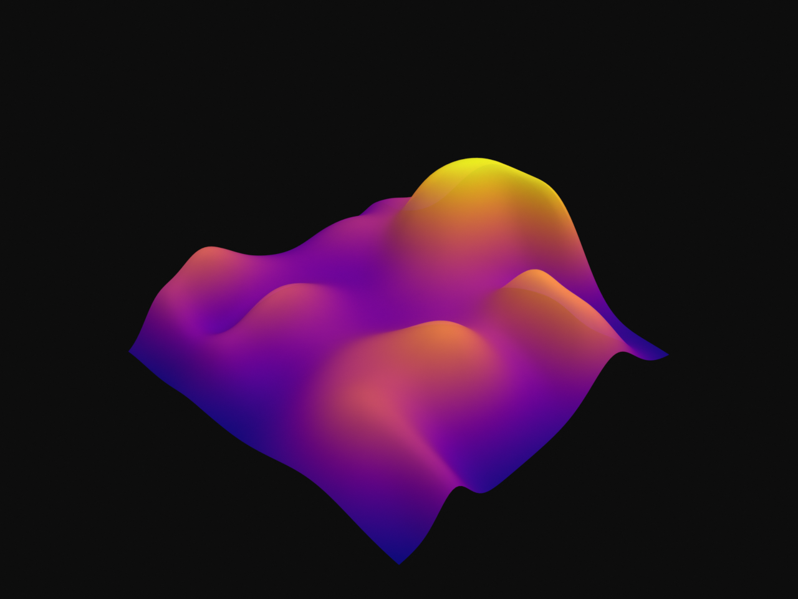
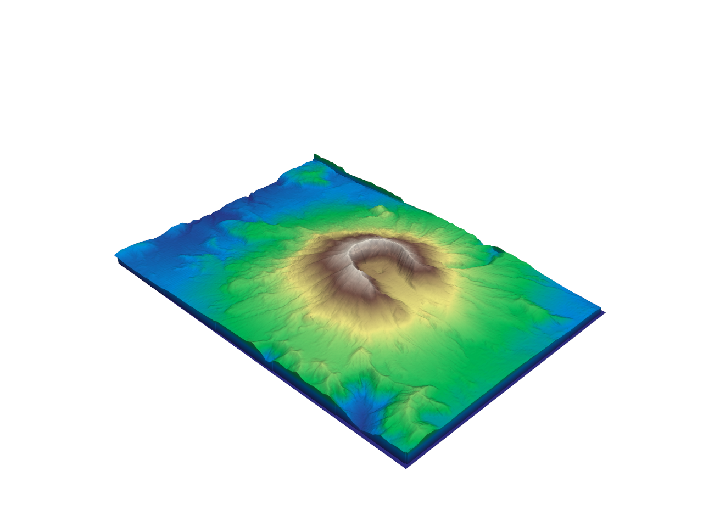
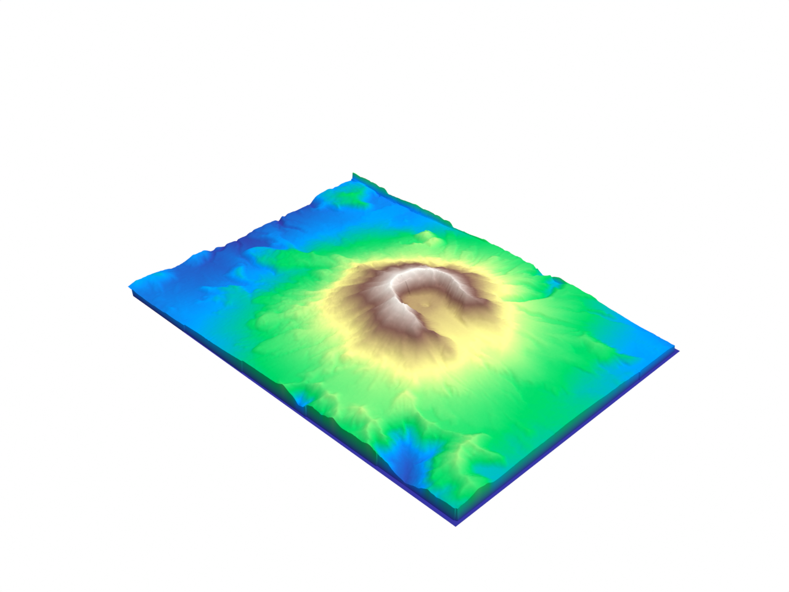
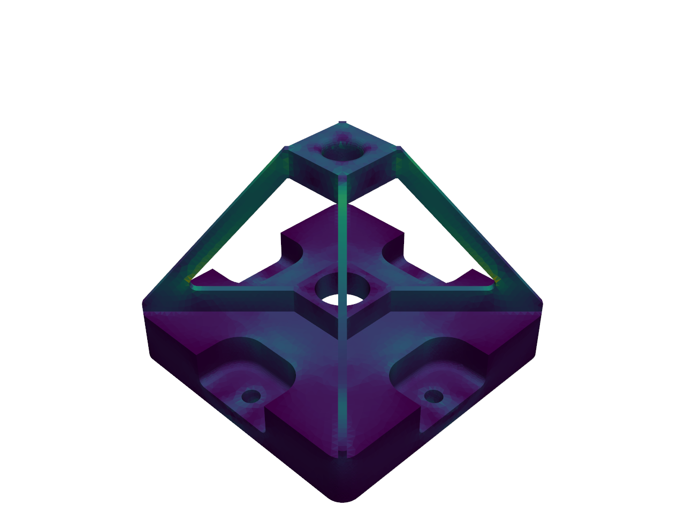
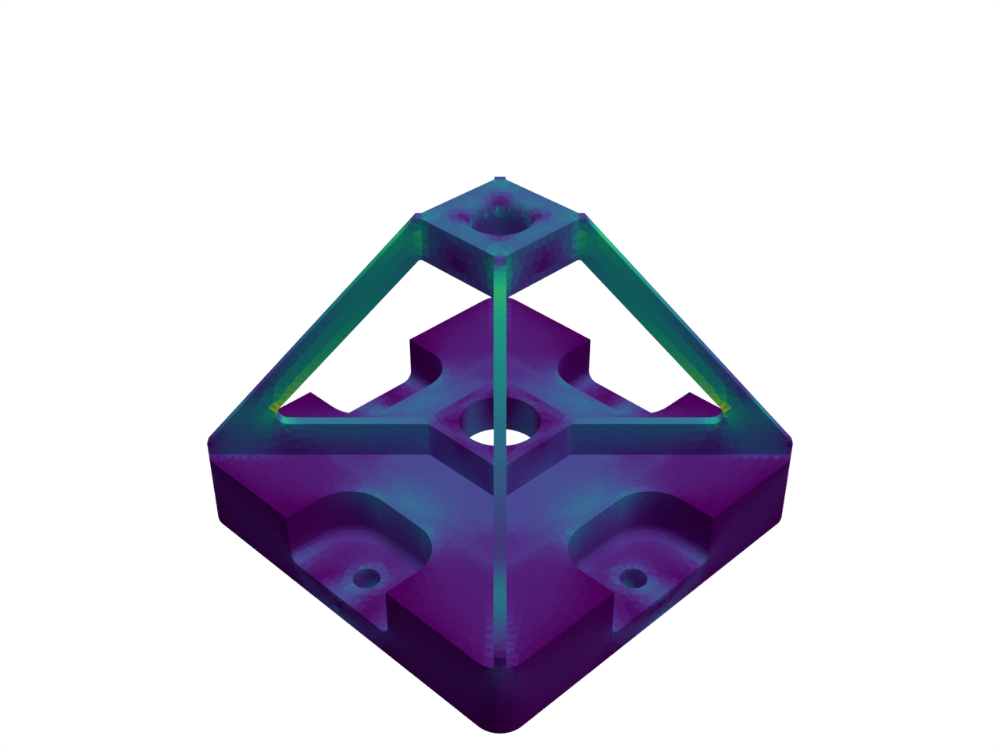
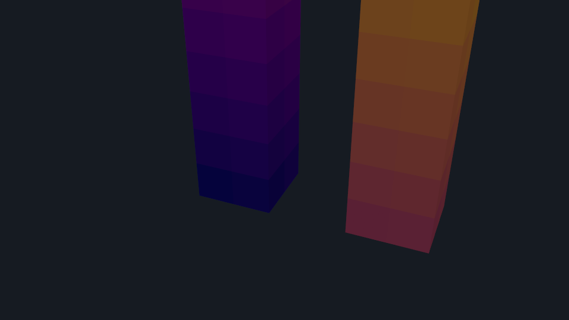
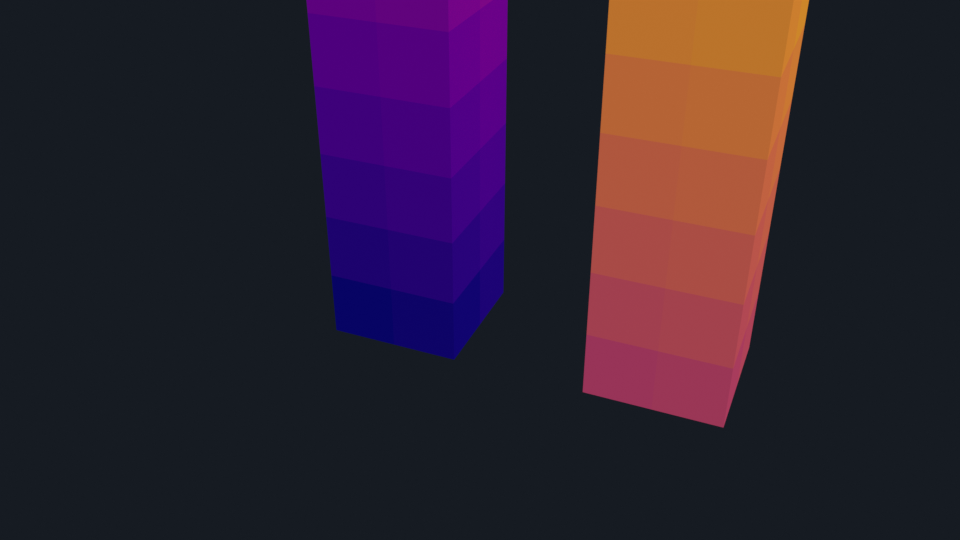

# Scalars & datasets

Real PyVista datasets with point-data and cell-data scalar fields.
Each example exercises a different branch of the color-attribute path.

## `random_hills.py`

PyVista's `load_random_hills` with point-data scalars and opacity.
Translucent terrain.

| PyVista                                                                      | Blender (Cycles)                                                             |
| ---------------------------------------------------------------------------- | ---------------------------------------------------------------------------- |
|  |  |

[`examples/scalars/random_hills.py`](https://github.com/kmarchais/pyvista-blender/blob/main/examples/scalars/random_hills.py).

## `st_helens.py`

Mount St. Helens elevation rendered through Cycles. Real-world DEM
dataset, no synthetic geometry.

| PyVista                                                                 | Blender (Cycles)                                                        |
| ----------------------------------------------------------------------- | ----------------------------------------------------------------------- |
|  |  |

[`examples/scalars/st_helens.py`](https://github.com/kmarchais/pyvista-blender/blob/main/examples/scalars/st_helens.py).

## `fea_bracket.py`

FEA bracket with smooth point-data colouring. Engineering visualization
use case.

| PyVista                                                                    | Blender (Cycles)                                                           |
| -------------------------------------------------------------------------- | -------------------------------------------------------------------------- |
|  |  |

[`examples/scalars/fea_bracket.py`](https://github.com/kmarchais/pyvista-blender/blob/main/examples/scalars/fea_bracket.py).

## `cell_scalars.py`

Per-cell scalar values via the CORNER-domain color attribute. Two hex
beams in a MultiBlock to show the merged-surface path.

| PyVista                                                                      | Blender (Cycles)                                                             |
| ---------------------------------------------------------------------------- | ---------------------------------------------------------------------------- |
|  |  |

[`examples/scalars/cell_scalars.py`](https://github.com/kmarchais/pyvista-blender/blob/main/examples/scalars/cell_scalars.py).
