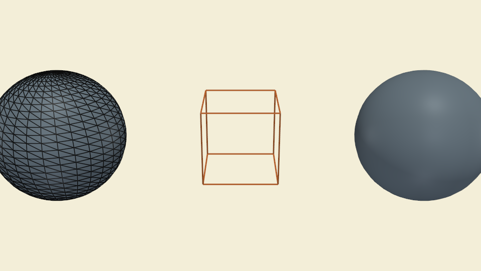
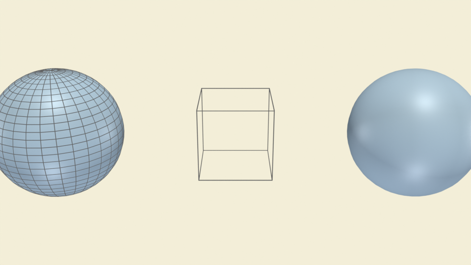

# Rendering styles

`surface + show_edges`, `wireframe`, and plain surface in one frame.
Exercises the wire-overlay duplicate path.

## `style_gallery.py`

| PyVista                                                                       | Blender (Cycles)                                                              |
| ----------------------------------------------------------------------------- | ----------------------------------------------------------------------------- |
|  |  |

[`examples/styles/style_gallery.py`](https://github.com/kmarchais/pyvista-blender/blob/main/examples/styles/style_gallery.py)
, recipe: [Rendering styles](../cookbook/styles.md).
